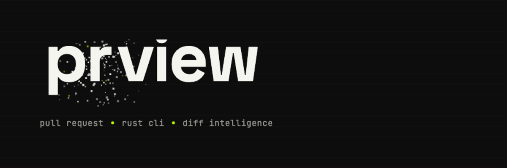

<p align="center">
  
</p>

<p align="center">
  <em>surfaces the signal before merge</em>
</p>

<p align="center">
  <code>pull request</code> · <code>rust cli</code> · <code>diff intelligence</code>
</p>

<p align="center">
  <a href="https://github.com/vetcoders/prview-rs/actions/workflows/ci.yml"></a>
  <a href="https://crates.io/crates/prview"></a>
  <a href="LICENSE"></a>
</p>

---

**prview** reads a pull request the way a good reviewer does: it separates signal from noise. It compares a branch against one or more bases, runs language-aware checks, computes structural heuristics, and emits both human- and machine-readable review packs — so you see the risk before you merge, not after.

No dashboards to babysit. No "powerful insights." Just the things that would block the merge, surfaced early.

```text
likely blocker in auth flow · coverage −2.1% · 1 breaking change in public API
```

## Why prview

- **Signal, not noise** — high-signal review pack: `PR_REVIEW.md`, compact failure summaries, coverage delta, breaking changes.
- **Merge decision support** — policy-aware `MERGE_GATE.json/.md` and optional per-finding `INLINE_FINDINGS.sarif`.
- **Multi-language** — JavaScript/TypeScript, Rust, Python, or mixed repos.
- **Fast** — native Rust binary, parallel checks, `git2` for git operations.
- **Structural heuristics** — Loctree (universal: cycles, dead code, twins across Rust/JS/TS/Python).
- **Made for agents** — a compact `AI_INDEX.md` entry point plus a native MCP server.
- **Shell completions** — bash, zsh, fish, elvish, powershell.

## Install

Quickest — download the latest checksum-verified release binary into `~/.local/bin` (no sudo):

```bash
curl -fsSL https://raw.githubusercontent.com/vetcoders/prview-rs/main/install.sh | sh
```

From crates.io:

```bash
cargo install prview --locked --force
```

`--force` overwrites any older `prview` in place, so upgrades are seamless; it is harmless on a clean machine.

From a local checkout (contributors / maintainers):

```bash
make install        # binary + local pre-commit / pre-push hooks
make install-bin    # binary only
```

Full instructions — release binaries, checksums, and PATH setup — live in [`docs/INSTALL.md`](docs/INSTALL.md).

## Quick start

```bash
# Fast local review of the current branch vs the default base
prview --quick

# Review a GitHub PR with stricter presets
prview --pr 23 --deep

# Run the automation gate with contractual exit codes
prview gate

# Open the latest generated dashboard
prview open
```

Every run writes an artifact pack:

- `AI_INDEX.md` — entry point for humans and agents
- `PR_REVIEW.md` — the unified review narrative
- `report.json` — machine-readable output
- `dashboard.html` — interactive exploration
- `00_summary/MERGE_GATE.json` — gate automation

## Usage

```bash
# Auto-detect profile, diff current branch vs the default base
prview

# Full analysis with stricter presets
prview --deep feature/x main

# Incremental update after new commits
prview --update feature/x main

# Python project
prview --profile python --with-tests --with-lint

# Compact JSON for CI / agents (stdout = JSON only)
prview --pr 23 --quick --json --quiet

# Gate JSON for automation
prview gate --json

# Interactive TUI for browsing results
prview --tui
```

The full flag reference is always one command away: `prview --help`. A written guide lives in [`docs/usage.md`](docs/usage.md).

## Quality gate

`prview gate` runs the standard fast gate profile, reads the verdict from the
generated merge-gate artifact, and exits with the automation contract:

| Exit code | Meaning |
|-----------|---------|
| `0` | `PASS`, or `CONDITIONAL` without `--strict` |
| `1` | `BLOCK` |
| `2` | `CONDITIONAL` with `--strict` |
| `3` | Gate execution failed before a trustworthy verdict was available |

Use `prview gate --json` for schema-friendly stdout with the verdict, caveats,
blocking issues, and artifact paths.

For local pre-push recipes and the recommended Shadow -> Warn -> Block rollout,
see [`docs/gate-playbook.md`](docs/gate-playbook.md).

### GitHub Action

External repositories can run the gate with one composite Action step:

```yaml
permissions:
  contents: read
  security-events: write

jobs:
  prview:
    runs-on: ubuntu-latest
    steps:
      - uses: actions/checkout@v4
        with:
          fetch-depth: 0
      - uses: vetcoders/prview-rs@v0.6.0
        id: prview
        with:
          strict: "true"
          version: "0.6.0"
      - uses: github/codeql-action/upload-sarif@v3
        if: ${{ steps.prview.outputs['sarif-path'] != '' }}
        with:
          sarif_file: ${{ steps.prview.outputs['sarif-path'] }}
```

The Action maps pass/fail only from the `prview gate` exit-code contract. JSON
stdout is used for step-summary details and artifact paths, not for deciding
whether the check passed. `cargo-binstall` is used when available, with
`cargo install prview` as the fallback. Use a `version` that includes
`prview gate`; the command starts with the 0.6 release line.

GitHub code scanning accepts SARIF uploads through
`github/codeql-action/upload-sarif`. Keep SARIF under GitHub's ingestion limits:
10 MB gzip-compressed upload size and 50 displayed annotations per workflow
step.

## The review pack

| File | What it's for |
|------|---------------|
| `AI_INDEX.md` | Compact entry point for human/agent review |
| `PR_REVIEW.md` | Unified review narrative |
| `report.json` | Machine-readable findings |
| `dashboard.html` | Visual summary of the analysis |
| `00_summary/MERGE_GATE.json` | Pass/fail gate for automation |
| `INLINE_FINDINGS.sarif` | Per-finding annotations (optional) |

The merge decision is a single enum — `PASS`, `CONDITIONAL`, or `BLOCK` — so both humans and automation read one truth. See [`docs/contracts/merge_gate.md`](docs/contracts/merge_gate.md).

## MCP server

Agents don't have to drive the CLI and parse files. prview ships a native MCP (Model Context Protocol) server so an agent can run a review and consume the verdict and artifacts through tools. The server speaks JSON-RPC over stdio:

```bash
prview mcp
```

Canonical client entry (e.g. in an `mcp.json`):

```json
{
  "mcpServers": {
    "prview": { "command": "prview", "args": ["mcp"] }
  }
}
```

Six tools cover the loop end to end:

| Tool | Purpose |
|------|---------|
| `health` | Confirm prview is operational; report version, git, and per-repo tool availability. |
| `state` | Cheap repo snapshot: branch, HEAD, dirty, files changed, latest run for HEAD. |
| `run_review` | Generate a review pack (`quick` synchronous, `deep` detached — poll `verdict`). |
| `verdict` | Single decision truth for a run: `PASS`/`CONDITIONAL`/`BLOCK`, blocking issues, caveats, per-gate status. |
| `findings` | Paged structured findings, filterable by severity and path. |
| `read_artifact` | Raw artifact body, paged and guarded to stay inside the run directory. |

Every tool takes an explicit absolute `repo` path and reads truth from storage, so the server never depends on its own working directory. Every response carries `schema_version: "prview.mcp.v1"`, and failures are fail-loud — a structured `error_class`, never an empty success. Full reference: [`docs/mcp.md`](docs/mcp.md).

Use `prview mcp --probe` as the first manual smoke check; it performs a real MCP handshake and exits instead of leaving the stdio server waiting for a client.

## Repository workflow

`prview-rs` is trunk-based on `main`:

- `main` — the trunk and the stable release branch
- feature / fix / chore branches are created from `main` and open PRs back into `main`
- PRs land as merge commits (no squash)
- release tags (`v*`) are cut from `main`

The `prview` tool itself analyzes repositories using any base branch (`develop`, `main`, `master`, …).

## Shell completions

```bash
prview completions bash > $HOME/.local/share/bash-completion/completions/prview
prview completions zsh  > $HOME/.zfunc/_prview
prview completions fish > $HOME/.config/fish/completions/prview.fish
```

## Documentation

- [`docs/INSTALL.md`](docs/INSTALL.md) — installation details
- [`docs/usage.md`](docs/usage.md) — full usage guide
- [`docs/configuration.md`](docs/configuration.md) — policy & config
- [`docs/gate-playbook.md`](docs/gate-playbook.md) — hook recipes and gate rollout
- [`docs/mcp.md`](docs/mcp.md) — MCP server for agents
- [`docs/mcp-smoke.md`](docs/mcp-smoke.md) — MCP smoke walkthrough for agents
- [`docs/architecture.md`](docs/architecture.md) — how it works
- [`docs/development.md`](docs/development.md) — contributing
- [`docs/contracts/merge_gate.md`](docs/contracts/merge_gate.md) — `MERGE_GATE.json` contract

## License

BUSL-1.1 — see [LICENSE](LICENSE). Package and binary are both named `prview`; the GitHub repo remains `prview-rs`.

<p align="center"><sub><code>prview</code> · surfaces the signal before merge</sub></p>
